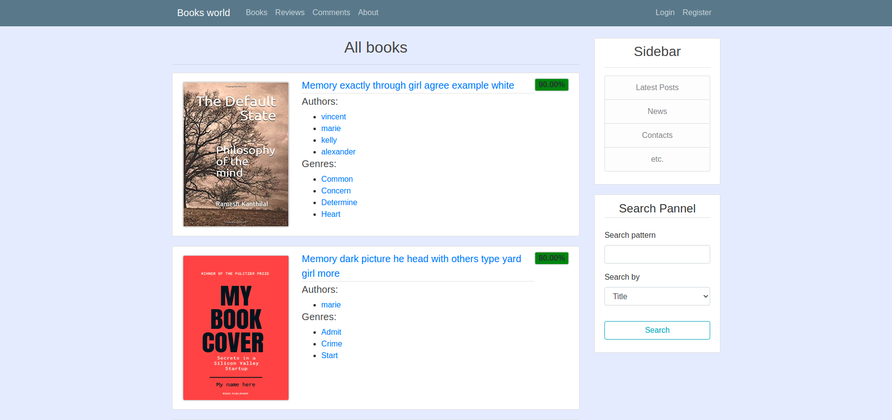
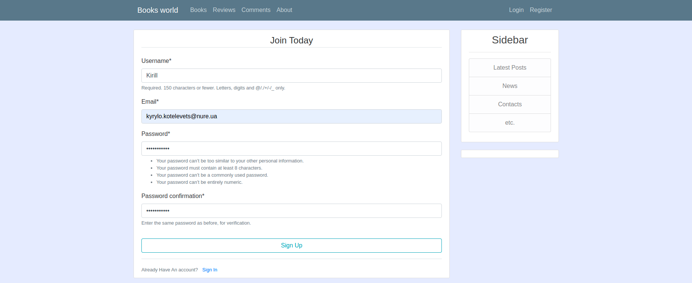
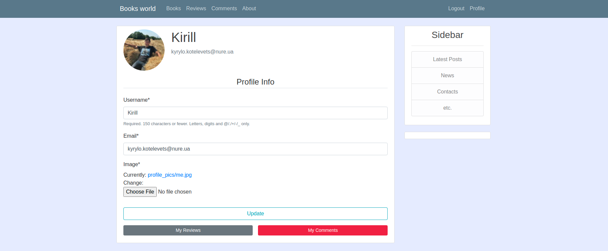

# Django Book Reviews
***

Django Book Reviews app - Python project with Django Framework.
Database is Postgresql so psycopg2 database adapter was added to requirements file.
Database randomly seeds while the server starting.

## Installation
***

The best way to use start project is a run docker-compose up command
and everything will work correctly. 
Make sure docker and docker-compose are installed, and docker service is running on your system.
So just run next command in root directory:

```bash
docker-compose up -d --build
```


## Run
***

Firstly you may check all running containers by:

```bash
docker ps
```

As a result, you will see all docker containers running now.


## Screenshots
***




